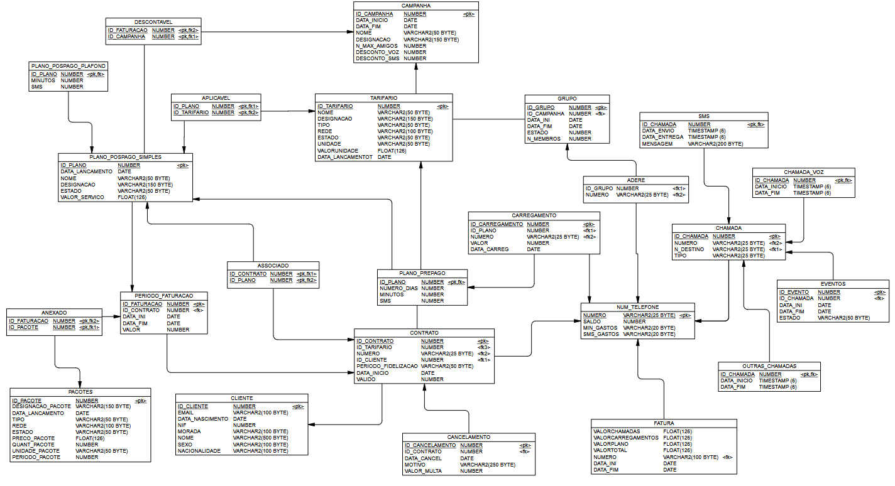

# Telecommunications Database Project

Welcome to the **Telecommunications Database Project**! This repository contains all the necessary files and documentation for understanding, implementing, and managing a robust telecommunications database system. Below, you'll find an overview of the project structure, its purpose, and instructions for navigation.

---

## Project Overview

This project is designed to model and manage key aspects of a telecommunications service, including clients, contracts, billing, calls, SMS, and campaigns. The database is structured to ensure data integrity, scalability, and ease of use, leveraging mechanisms like triggers, stored procedures, and views for efficient data management.

---

## Language Note

**Important**: Some parts of the code and documentation are written in **Portuguese (Portugal)** as the project was originally developed in that language. However, the repository is organized to be intuitive, and additional explanations are provided in English to ensure broader accessibility.

---

## Database Diagram

Below is the database schema diagram for the project:

---

## Repository Structure

The repository is divided into three main sections:

### **1. Documentation (`docs/`)**
Contains all the supporting materials to understand the database's structure, design decisions, and operational integrity:
- **`database_diagram.png`**: A visual representation of the database schema.
- **`integrity_mechanisms.md`**: Explanation of the mechanisms used to ensure data integrity (e.g., constraints, triggers).
- **`physical_parameters.md`**: Details the physical design considerations (e.g., indexes, partitioning, storage).
- **`schema_description.md`**: A detailed description of the database schema, tables, fields, and relationships.

### **2. SQL Files (`sql/`)**
Houses all the SQL scripts necessary to create and manage the database:
- **`create_database.sql`**: Script to create the database schema and define its tables and relationships.
- **`functions_code.sql`**: Contains SQL functions that implement custom business logic.
- **`procedures_code.sql`**: Includes stored procedures for batch operations or reusable workflows.
- **`triggers_code.sql`**: Defines database triggers for automated actions.
- **`views_code.sql`**: Scripts for creating database views that simplify querying complex data.

---

## License

This project is licensed under the [MIT License](/LICENSE). Feel free to use, modify, and distribute this project.
